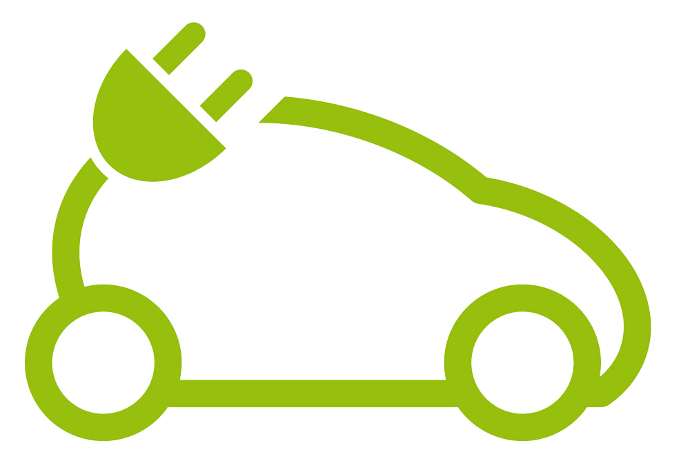

# BMS-Mobile
## IOEV Solution 
#### By

BMS-MobileApp is a part of our Solution  
## Features
    -Connect mobile app to your car baterry using bluetooth
    -Get Alerts, Notification
    -Find Out all about your car history and Current Status
    -and More

## Flutter Packages Used
    -Provider
    -Flutter_Blue
    -Sqflite
    -and more

## To run the app
### on android 
    -Just go to [!app apk](build/app/outputs/flutter-apk/app-release.apk)
    -Downlaod the apk 
    -install it on your device 
    -allow loaction access while using the app 

### on iOS
    You have to install xCode
    -go to xcode and open [!iOS](ios/Runner.xcodeproj/project.pbxproj)
    -connect your real device 
    -run the project
    -allow acess

